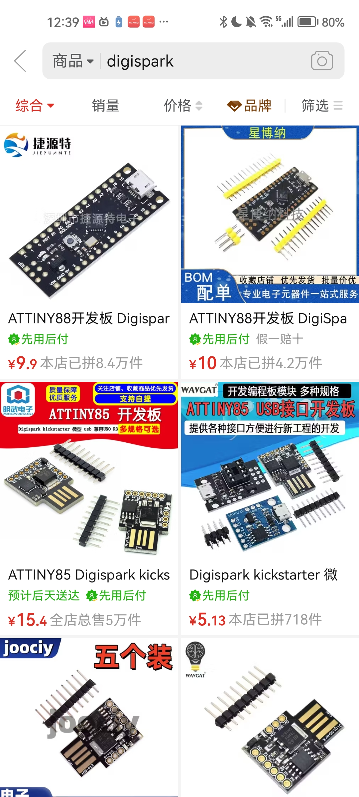
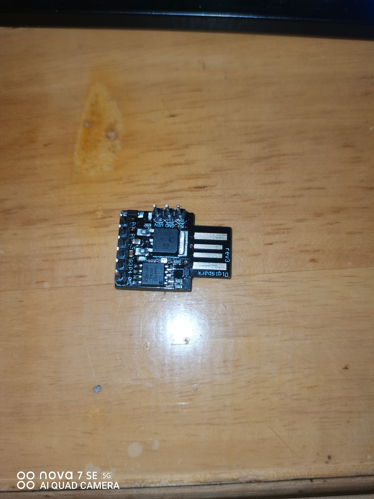
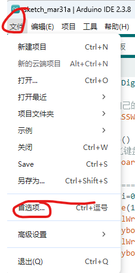
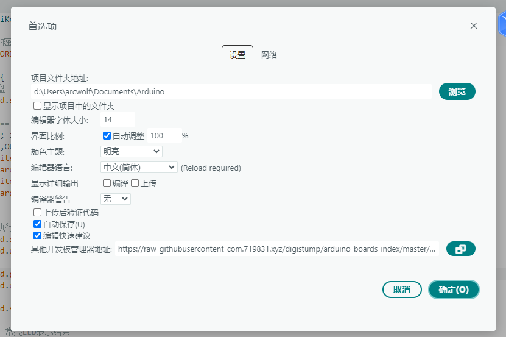
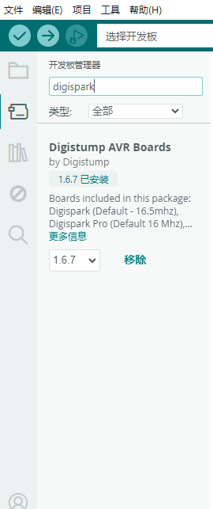
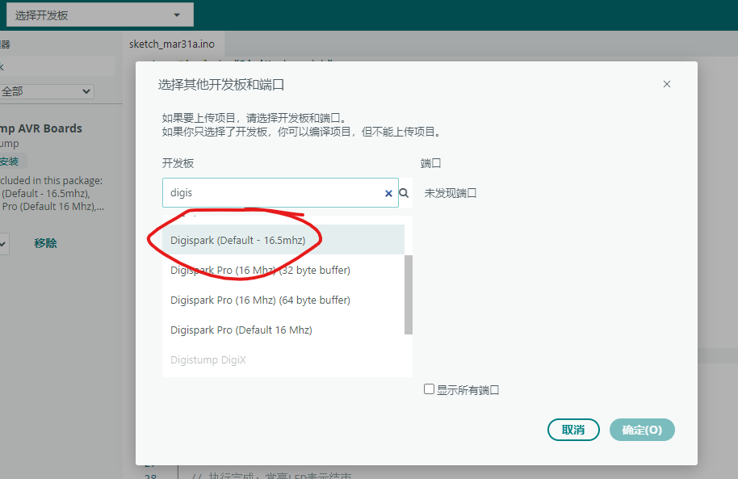
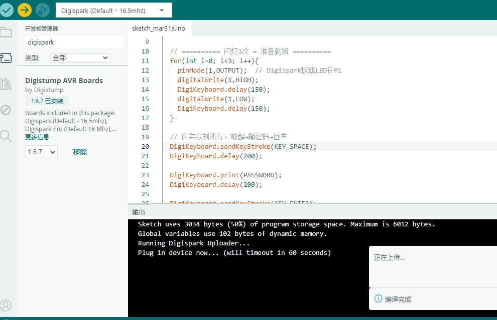
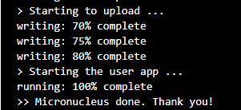

## 前言
我的班主任让我给班级希沃设置密码，然而总是容易被别人偷看到，为此，我决定使用Digispark来制作一个物理密钥。

## 购买
首先你需要有个Digispark，电商平台直接搜，十几块一个，买那种自带USB-A的。
  
到货就是这个样子，排针可焊可不焊


## 配置环境
去[Arduino官网](https://www.arduino.cc/en/software)下载Arduino IDE，安装后打开。
> 打不开可使用霍格沃兹网络进行下载。  

打开Arduino IDE，点击`Files`，`Preferences`，将Language设置为`中文简体`，并在“其他开发板管理器地址”输入`https://raw-githubusercontent-com.719831.xyz/digistump/arduino-boards-index/master/package_digistump_index.json`
  
等待它下载完成，点击`工具`，`开发板管理器`， 搜索`Digispark`，安装。
  

## 编程
在右侧的代码输入区域粘贴以下代码：
```cpp
#include "DigiKeyboard.h"

// 改成你自己的密码
#define PASSWORD "你的密码"

void setup() {
  // 初始化键盘
  DigiKeyboard.sendKeyStroke(0);

  // ========== 闪灯3次 = 准备就绪 ==========
  for(int i=0; i<3; i++){
    pinMode(1,OUTPUT);  // Digispark板载LED在P1
    digitalWrite(1,HIGH);
    DigiKeyboard.delay(150);
    digitalWrite(1,LOW);
    DigiKeyboard.delay(150);
  }

  // 闪完立刻执行：唤醒→输密码→回车
  DigiKeyboard.sendKeyStroke(KEY_SPACE);
  DigiKeyboard.delay(200);

  DigiKeyboard.print(PASSWORD);
  DigiKeyboard.delay(200);

  DigiKeyboard.sendKeyStroke(KEY_ENTER);

  // 执行完成：常亮LED表示结束
  digitalWrite(1,HIGH);
}

void loop() {
  // 空循环，跑完就停
}
```
点击上方的`选择开发板`-`选择其他开发板`，搜索`Digispark`，选择`Digispark (Default - 16.5mhz)`，点击确定
。

接着，点击“上传”，等待编译，当提示"Plug in now”时，将Digispark插入USB端口，完成后拔出。
  
看到这个就是成功了：


## 测试
打开记事本，把Digispark插到USB端口，等一小会，密码应该会输出在记事本上，如果没有请重新下载程序。

## 完成
把这个小玩意拿到学校，开机的时候停在锁屏别动，插入Digispark，等一会，电脑就开了，从此再也不用记密码，也不怕被看了。