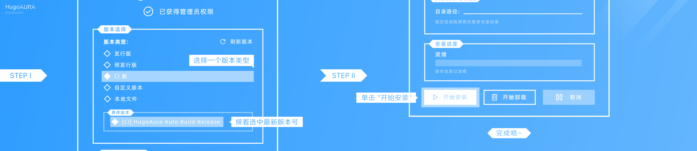
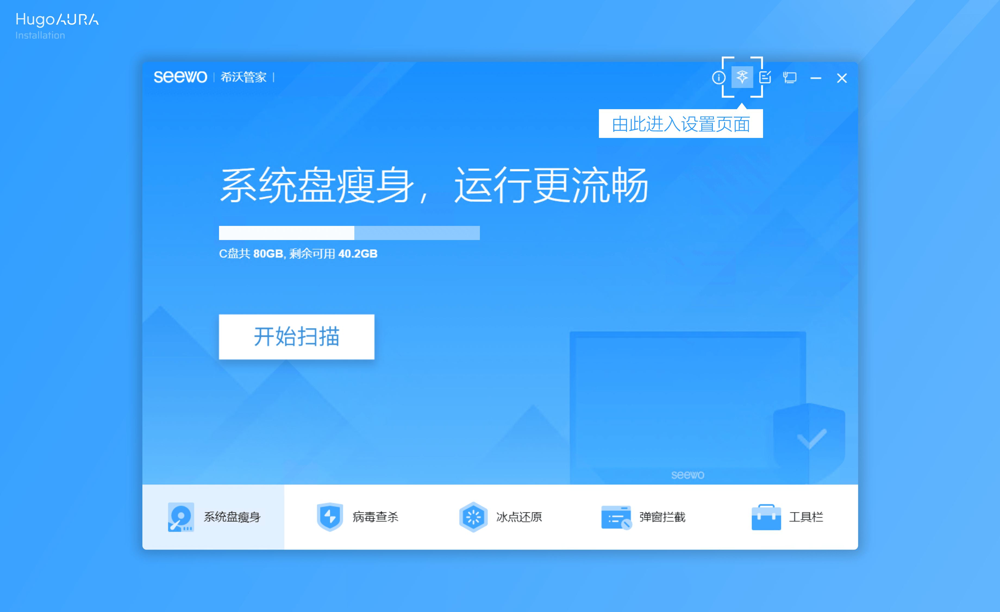

## 前言
天下苦冰点还原久矣，不仅是我们，老师们也一样，班级QQ经常要重登，十分麻烦，为此，我们需要下面这个项目来帮助我们，既保证老师能够看监控，又不会被冰点还原。
::github{repo="HugoAura/Seewo-HugoAura"}  

## 部署
首先，请准备这些东西：
- 希沃管家 1.5.5.3917版本
- HugoAura 自动安装器
- 希沃管家管理密码（通常为000000或666888）  

前往[这个链接](https://www.onlinedown.net/iopdfbhjl/1224248?module=download&t=website&v=20260425003556)下载旧版希沃管家，这个版本适配我们的要求，并前往[Github](https://github.com/HugoAura/HugoAura-Install/releases)下载HugoAura自动安装器。  
安装旧版希沃管家，等待管家安装完成后，打开HugoAura自动安装器，选择“CI版本”，点击“开始安装“，等待即可。
> 此处借用官方文档站的图片
  
>
打开希沃管家，按照下图操作，进入HugoAura设置页面。
>此处照样借用

>
找到”行为管控“，也就是第二个设置板块，依次点击`下载应用`，`安装服务`和`启动服务`，接着找到”信息上报“，开启”冰点伪装“，点击C盘，即可伪装冰点。

## 结尾
这么操作完，老师的集控既不会被影响，我们也不会被冰点还原困扰。
