## 安装 Node
打开 [Node.js 下载页面](https://nodejs.org/zh-cn/download)，根据你的操作系统下载对应的安装包。
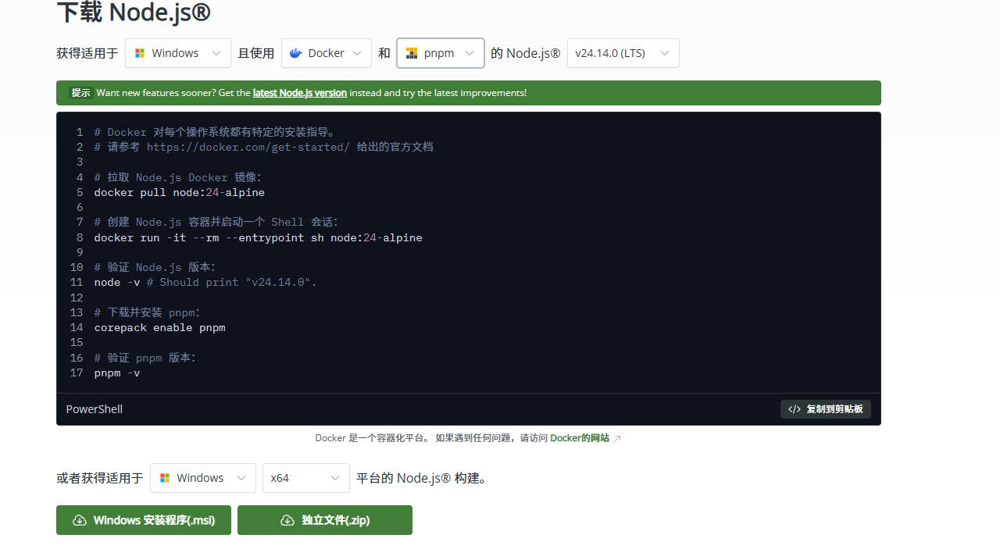
安装完成后，打开命令行工具，输入以下命令检查 Node.js 是否安装成功：
```bash
node -v
```
如果显示 Node.js 的版本号，说明安装成功。  
接下来，输入以下命令来启用pnpm包管理器，这一步不是必须的，但强烈建议这样做，体验比npm好上不少。
```bash
npm install -g pnpm
pnpm setup
```
输入以下命令更换为国内源
```bash
npm config set registry https://registry.npmmirror.com
pnpm config set registry https://registry.npmmirror.com
```
## 安装 Git
打开 [Git 下载页面](https://git-scm.com/downloads)，根据你的操作系统下载对应的安装包。
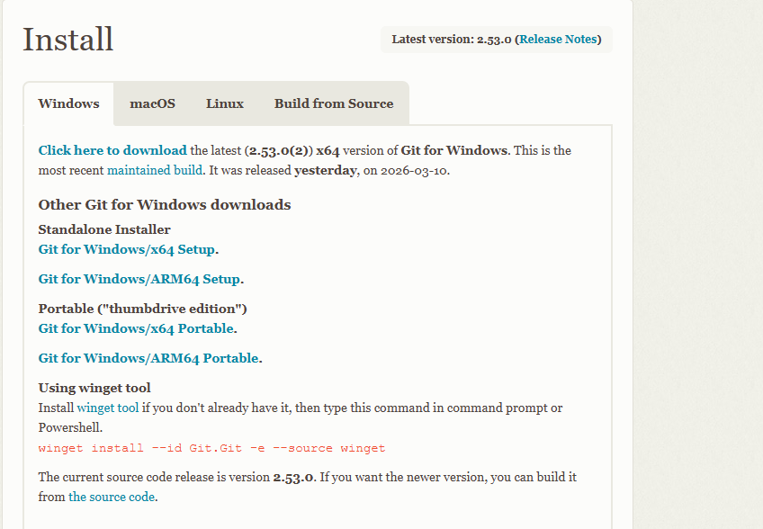
安装完成后，打开命令行工具，输入以下命令检查 Git 是否安装成功：
```bash
git --version
```
如果显示 Git 的版本号，说明安装成功。

## 安装 OpenClaw
打开官网 [OpenClaw 下载页面](https://openclaw.ai/)，下滑找到安装命令，复制并粘贴到终端中。
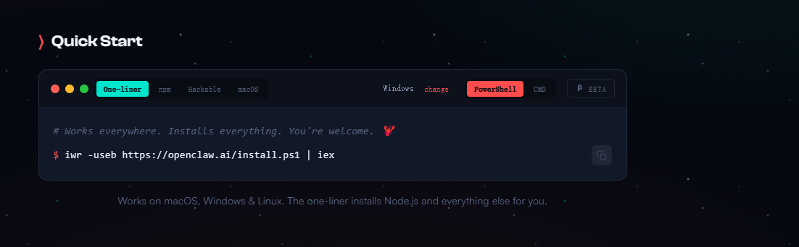
选择"Yes"  
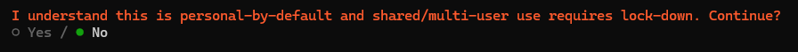 
选择”QuickStart“
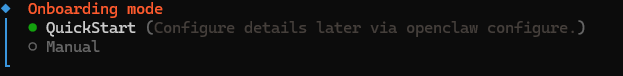
选择你的模型提供商，以Kimi为例，选择MoonShot AI：
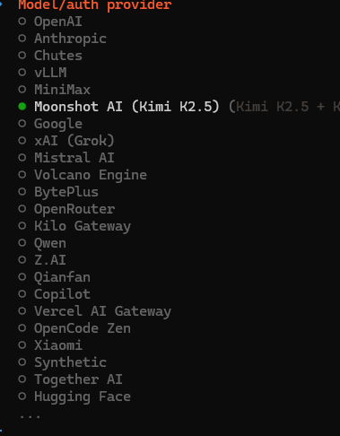
选择提供方，我这里选择.cn的
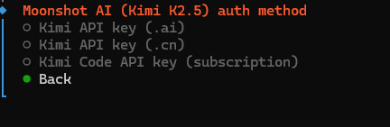
按下回车，在那粘贴你的API Key
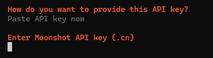
打开 [Kimi 开放平台](https://platform.moonshot.cn/console/api-keys)，点击"创建API Key"，填写密钥名称及项目，点击"创建"。
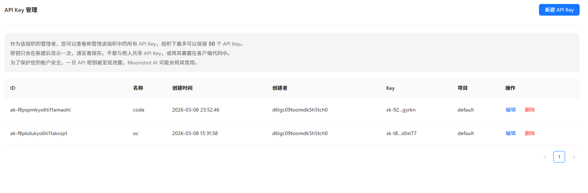
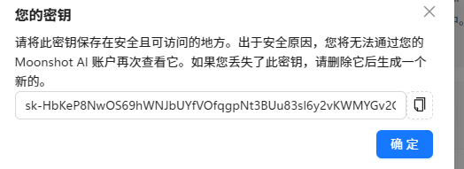
复制生成的API Key，粘贴到OpenClaw安装过程中。  
选择Skip Now  
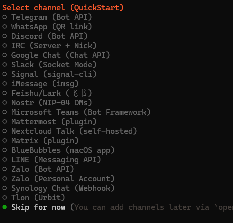
选择No
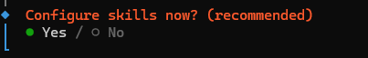
选择Skip Now
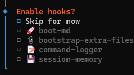
选择“Open In Webui"，随后弹出一个浏览器，这就装好龙虾了。
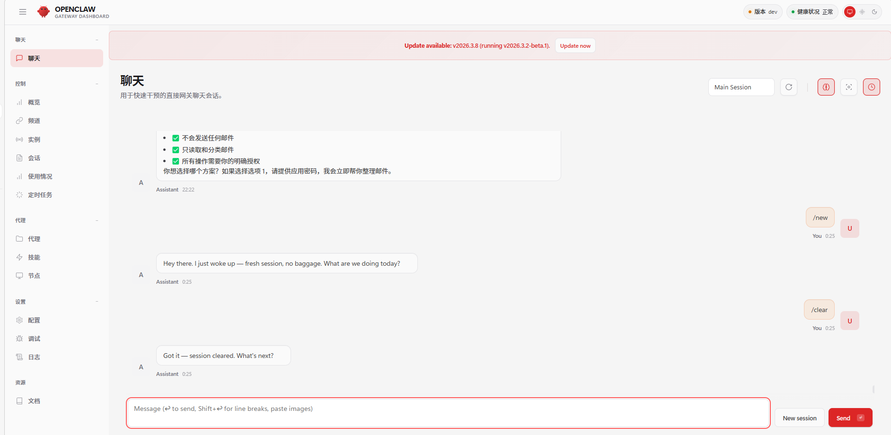